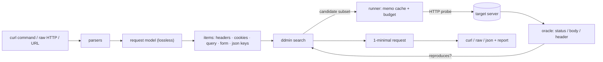

# reqmin

[English](README.md) | [中文](README.zh.md) | [日本語](README.ja.md)

[](LICENSE) [](go.mod) [](CHANGELOG.md)  [](CONTRIBUTING.md)

**reqmin：HTTP リクエスト向けオープンソースの delta-debugging 最小化ツール——ヘッダー 40 個の「Copy as cURL」を貼り付ければ、本当に再現に必要な 2 個だけが返ってくる。**


```bash
git clone https://github.com/JaydenCJ/reqmin && cd reqmin
go build -o reqmin ./cmd/reqmin    # single static binary, stdlib only
```

> プレリリース：v0.1.0 はまだどのパッケージレジストリにも公開されていません。上記の手順でソースからビルドしてください（Go ≥1.22 なら可）。

## なぜ reqmin か？

API をデバッグする人なら誰でもこの儀式を知っています。リクエストが不調になり、「Copy as cURL」を押すと、クリップボードにはヘッダー 40 個、Cookie が十数個、誰が足したか覚えていないクエリパラメータが着地します。バグを起こしているのはどの 3 つか？既存の答えはどれも不十分です。ターミナルや Postman 系クライアントでの手動二分探索は、ヘッダーを消して再送して戻す作業の繰り返し——O(n) の苦行で、誰もが途中で投げ出すため、バグ報告には今もヘッダー 40 個の塊が丸ごと添付されます。汎用ファイル縮小ツール（creduce、delta）のアルゴリズムは見事ですが、土台が間違っています。バイトと行を噛み砕くので、正しい HTTP でない候補を平気で生み出すうえ、肝心の構造——`Cookie` ヘッダーは実は 6 個の独立した Cookie であること、JSON ボディはキーの木であること、クエリパラメータを消しても隣を再エンコードしてはならないこと——を一切知りません。reqmin はそのアルゴリズムを正しい土台に載せました。リクエストをヘッダー・Cookie・クエリパラメータ・フォームフィールド・ネストした JSON キーに分解し、ddmin を実行——部分集合を試し、繰り返しをメモ化し、リクエスト予算で制御——して **1-minimal** なリクエストに到達します。残ったどの 1 項目を消しても挙動は消える、という状態です。典型的な結果：22 項目が約 30 回の自動プローブで 2 項目になり、そのまま貼り付けられる curl コマンドが出てきます。

| | reqmin | 手動二分探索 | Postman 系クライアント | creduce 系縮小ツール |
|---|---|---|---|---|
| 最小の再現サブセットを自動で発見 | ✅ ddmin、1-minimal | ❌ ループはあなた | ❌ ループはあなた | ✅ ただし行ベース |
| HTTP 構造を理解（Cookie、JSON キー、パラメータ） | ✅ 6 種のアイテム | — | — | ❌ バイトと行 |
| 候補が常に正しい HTTP リクエスト | ✅ 構造上保証 | ✅ | ✅ | ❌ |
| 生き残りは元とバイト単位で同一（再エンコードなし） | ✅ | ✅ | ⚠️ クライアントが再直列化 | ❌ |
| 対象サーバーへのコスト制御 | ✅ メモ化キャッシュ + 予算 | — | — | ❌ 無制限に実行 |
| 貼り付けた `curl` と生 HTTP、オフライン、依存ゼロ | ✅ | ✅ | ❌ GUI アプリ | ⚠️ スクリプトの土台が必要 |

<sub>依存数の確認日 2026-07-13：reqmin が import するのは Go 標準ライブラリのみ。人気の対話型 API クライアントはフルサイズのデスクトップアプリとして配布されます。</sub>

## 特徴

- **リクエスト版 creduce** —— ヘッダー、クエリパラメータ、個々の Cookie、フォームフィールド、ネストした JSON キー、不透明ボディの上で Zeller の ddmin を実行。結果はオラクルに対して証明可能に 1-minimal。
- **ブラウザの吐くものを丸ごと受ける** —— 本物のシェル字句解析（シングル/ダブル/`$'…'` クォート、行継続）と DevTools が出力する curl フラグ集合に対応。生の HTTP/1.1 メッセージや裸の URL も、ファイル・stdin・argv から使えます。
- **「まだ再現する」の定義はあなたが握る** —— `--expect-status`、`--expect-body-contains`、`--expect-body-regex`、`--expect-header` を AND で結合。フラグなしならベースラインのステータスコードに固定。
- **生き残りは無損失** —— 残ったクエリ/フォームのペアはパーセントエンコーディングをそのまま維持、ヘッダーは順序と重複を維持、JSON はメンバー順と数値リテラルを維持。元との差分は削除だけ。
- **対象サーバーに礼儀正しく** —— 同一候補はメモ化キャッシュが応答し、`--max-requests` が実行に上限を課し（予算切れでも見つけた最良の縮小を出力）、リダイレクトは追わずに報告します。
- **忠実なリプレイ** —— `User-Agent` や `Accept-Encoding` を注入せず、`Content-Length` は再計算。出力されるのは実際に送ったものそのもので、curl ワンライナー・生 HTTP メッセージ・JSON レポートから選べます。
- **依存ゼロ・完全オフライン** —— Go 標準ライブラリのみ。テレメトリなし。外向き通信は、あなたが指定した対象への、あなたが求めたプローブだけです。

## クイックスタート

```bash
go run ./examples/demo-server &    # loopback API that checks only a token and ?user=
./reqmin examples/copied.curl      # a 14-header, 4-cookie browser capture
```

実際にキャプチャした出力——削除可能 22 項目、ループバックプローブ 32 回、生存 2 項目：

```text
baseline: status 200 satisfies oracle (status == 200)
items: 22 removable (14 headers, 4 query params, 4 cookies)
probes: 32 requests sent, 0 answered from cache
result: kept 2 of 22 items
  kept     header  Authorization
  kept     query   user
curl 'http://127.0.0.1:8641/api/orders?user=42' -H 'Authorization: Bearer demo-token'
```

レポートは stderr、最小化されたリクエストは stdout へ——パイプに流すことも、生 HTTP メッセージとして書き出すこともできます。明示的なオラクルで注目する挙動を固定できます（実際の出力）：

```bash
./reqmin --format raw --expect-body-contains '"orders"' examples/copied.curl
```

```text
GET /api/orders?user=42 HTTP/1.1
Host: 127.0.0.1:8641
Authorization: Bearer demo-token
```

`--dry-run` は何も送信せずに削除可能な項目を列挙します。`bash examples/reduce.sh` でデモ全体をエンドツーエンドで実行できます。

## 入力とオラクル

reqmin は入力を自動判別します：クォートされた `curl …` 文字列、それを含むファイル（行継続も可）、生の HTTP/1.1 メッセージ（ファイルまたは stdin の `-`）、裸の URL、クォートなしの `reqmin curl https://… -H …` という argv。述語は AND で合成されます：

| フラグ | 既定値 | 効果 |
|---|---|---|
| `--expect-status N` | ベースラインのステータスコード | レスポンスステータスが N に等しいこと |
| `--expect-body-contains S` | — | ボディが S を含むこと（繰り返し可） |
| `--expect-body-regex RE` | — | ボディが RE2 パターンに一致すること |
| `--expect-header 'K: v'` | — | レスポンスヘッダー K が v を含むこと。裸の `K` は存在だけを確認 |

## 探索と出力の制御

| フラグ | 既定値 | 効果 |
|---|---|---|
| `--keep GLOB` | — | 一致する項目を固定（`authorization`、`header:x-*`）。決して削除しない |
| `--only KINDS` | 全部 | `headers,query,cookies,form,json,body` に限定 |
| `--max-requests N` | 500 | プローブ予算。使い切っても見つけた最良の縮小を出力 |
| `--timeout D` | 10s | リクエストごとのタイムアウト |
| `--format F` | curl | `curl`・`raw`・`json`（機械可読な完全レポート） |
| `--out FILE` / `--dry-run` / `-q` | — | ファイルへ書き出し / 列挙のみ / レポートを抑制 |

終了コード：**0** 最小化完了 · **1** ベースラインがオラクルを満たさない · **2** 使い方の誤り · **3** ネットワーク/実行時障害。アルゴリズム、アイテムモデル、そして 1-minimality が約束すること（しないこと）は [docs/reduction.md](docs/reduction.md) に記載しています。

## 検証

このリポジトリは CI を同梱しません。上記の主張はすべてローカル実行で検証されます：

```bash
go test ./...            # 92 deterministic tests, offline, < 5 s
bash scripts/smoke.sh    # end-to-end CLI check against a loopback API, prints SMOKE OK
```

## アーキテクチャ



## ロードマップ

- [x] v0.1.0 —— メモ化と予算つき ddmin エンジン、6 種アイテムモデル（ヘッダー、Cookie、クエリ、フォーム、ネスト JSON キー、生ボディ）、curl/生 HTTP/URL 入力、ステータス/ボディ/ヘッダーのオラクル、無損失な curl/raw/json 出力、`--keep`/`--only`/`--dry-run`、テスト 92 件 + smoke スクリプト
- [ ] 値レベルの縮小：ヘッダーやパラメータの*値*を縮める（トークン切り詰め、JSON 配列要素）
- [ ] 不安定なエンドポイント向け `--stable N` 再検証と、不一致時の自動リトライ
- [ ] HAR ファイル入力：ブラウザセッションのエクスポートからリクエストを選択
- [ ] 遅い対象向けの並列プローブ（同時実行数の上限つき）
- [ ] レスポンス差分オラクル：「再現」= ベースラインと同一レスポンス（無視リスト設定可）

全リストは [open issues](https://github.com/JaydenCJ/reqmin/issues) を参照してください。

## コントリビュート

Issue・ディスカッション・PR を歓迎します——ローカルのワークフロー（フォーマット、vet、テスト、`SMOKE OK`）は [CONTRIBUTING.md](CONTRIBUTING.md) へ。入門タスクは [good first issue](https://github.com/JaydenCJ/reqmin/issues?q=is%3Aissue+is%3Aopen+label%3A%22good+first+issue%22)、設計の議論は [Discussions](https://github.com/JaydenCJ/reqmin/discussions) にあります。

## ライセンス

[MIT](LICENSE)
