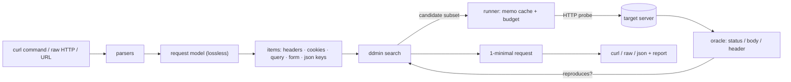

# reqmin

[English](README.md) | [中文](README.zh.md) | [日本語](README.ja.md)

[](LICENSE) [](go.mod) [](CHANGELOG.md)  [](CONTRIBUTING.md)

**reqmin：an open-source delta-debugging minimizer for HTTP requests — paste a "Copy as cURL" capture with 40 headers, get back the two that actually reproduce.**


```bash
git clone https://github.com/JaydenCJ/reqmin && cd reqmin
go build -o reqmin ./cmd/reqmin    # single static binary, stdlib only
```

> Pre-release: v0.1.0 is not tagged on a package registry yet; build from source as above (any Go ≥1.22).

## Why reqmin?

Every API debugger knows the ritual. A request misbehaves, you hit "Copy as cURL", and the clipboard lands with 40 headers, a dozen cookies, and query params nobody remembers adding. Which three of them make the bug happen? The existing answers are all bad. Hand bisection in a terminal or a Postman-style client means minutes of deleting a header, resending, undoing — an O(n) slog that everyone abandons halfway, which is why bug reports still ship the full 40-header blob. Generic file reducers (creduce, delta) run a brilliant algorithm but on the wrong substrate: they chew bytes and lines, happily producing candidates that are not valid HTTP, and they know nothing about the structure that matters — that a `Cookie` header is really six independent cookies, that a JSON body is a tree of keys, that dropping a query param must not re-encode its neighbors. reqmin is that algorithm on the right substrate: it decomposes the request into headers, cookies, query params, form fields, and nested JSON keys, then runs ddmin — probing subsets, memoizing repeats, capped by a request budget — until it holds the **1-minimal** request: remove any single remaining item and the behavior disappears. Typical result: 22 items down to 2, in ~30 automated probes, with a copy-pasteable curl command out the other end.

| | reqmin | hand bisection | Postman-style clients | creduce-style reducers |
|---|---|---|---|---|
| Finds the minimal reproducing subset automatically | ✅ ddmin, 1-minimal | ❌ you are the loop | ❌ you are the loop | ✅ but line-based |
| Understands HTTP structure (cookies, JSON keys, params) | ✅ 6 item kinds | — | — | ❌ bytes and lines |
| Every candidate is a valid HTTP request | ✅ by construction | ✅ | ✅ | ❌ |
| Survivors byte-identical to the original (no re-encoding) | ✅ | ✅ | ⚠️ client re-serializes | ❌ |
| Cost control against the target server | ✅ memo cache + budget | — | — | ❌ unbounded runs |
| Works on pasted `curl` and raw HTTP, offline, zero deps | ✅ | ✅ | ❌ GUI app | ⚠️ needs a script harness |

<sub>Dependency count checked 2026-07-13: reqmin imports the Go standard library only; the popular interactive API clients ship as full desktop applications.</sub>

## Features

- **creduce for requests** — Zeller's ddmin over headers, query params, individual cookies, form fields, nested JSON body keys, and opaque bodies; the result is provably 1-minimal against your oracle.
- **Eats what browsers emit** — a real shell tokenizer (single/double/`$'…'` quoting, line continuations) and the curl flag subset DevTools produce; raw HTTP/1.1 messages and bare URLs work too, from a file, stdin, or argv.
- **You define "still reproduces"** — `--expect-status`, `--expect-body-contains`, `--expect-body-regex`, `--expect-header`, ANDed; with no flags it locks onto the baseline status code.
- **Lossless survivors** — kept query/form pairs keep their exact percent-encoding, headers keep order and duplicates, JSON keeps member order and number literals; the diff against the original is deletions only.
- **Polite to the target** — identical candidates are answered from a memo cache, `--max-requests` caps the run (budget exhaustion still emits the best reduction found), and redirects are reported, not followed.
- **Faithful replay** — no injected `User-Agent` or `Accept-Encoding`, `Content-Length` recomputed; what it prints is exactly what it sent, as a curl one-liner, a raw HTTP message, or a JSON report.
- **Zero dependencies, fully offline** — Go standard library only; no telemetry, and the only outbound traffic is the probes you asked for, at the target you named.

## Quickstart

```bash
go run ./examples/demo-server &    # loopback API that checks only a token and ?user=
./reqmin examples/copied.curl      # a 14-header, 4-cookie browser capture
```

Real captured output — 22 removable items, 32 loopback probes, 2 survivors:

```text
baseline: status 200 satisfies oracle (status == 200)
items: 22 removable (14 headers, 4 query params, 4 cookies)
probes: 32 requests sent, 0 answered from cache
result: kept 2 of 22 items
  kept     header  Authorization
  kept     query   user
curl 'http://127.0.0.1:8641/api/orders?user=42' -H 'Authorization: Bearer demo-token'
```

The report goes to stderr, the minimized request to stdout — pipe it, or write a raw HTTP message instead. An explicit oracle pins the behavior you care about (real output):

```bash
./reqmin --format raw --expect-body-contains '"orders"' examples/copied.curl
```

```text
GET /api/orders?user=42 HTTP/1.1
Host: 127.0.0.1:8641
Authorization: Bearer demo-token
```

`--dry-run` lists the removable items without sending anything; `bash examples/reduce.sh` runs the whole demo end to end.

## Inputs and oracle

reqmin auto-detects its input: a quoted `curl …` string, a file containing one (line continuations fine), a raw HTTP/1.1 message (file or `-` for stdin), a bare URL, or an unquoted `reqmin curl https://… -H …` argv. Predicates compose with AND:

| Flag | Default | Effect |
|---|---|---|
| `--expect-status N` | baseline status | response status must equal N |
| `--expect-body-contains S` | — | body must contain S (repeatable) |
| `--expect-body-regex RE` | — | body must match the RE2 pattern |
| `--expect-header 'K: v'` | — | response header K must contain v; bare `K` checks presence |

## Search and output controls

| Flag | Default | Effect |
|---|---|---|
| `--keep GLOB` | — | pin matching items (`authorization`, `header:x-*`); never removed |
| `--only KINDS` | all | restrict to `headers,query,cookies,form,json,body` |
| `--max-requests N` | 500 | probe budget; exhaustion still emits the best reduction |
| `--timeout D` | 10s | per-request timeout |
| `--format F` | curl | `curl`, `raw`, or `json` (full machine-readable report) |
| `--out FILE` / `--dry-run` / `-q` | — | write to a file / enumerate only / silence the report |

Exit codes: **0** minimized · **1** baseline does not satisfy the oracle · **2** usage error · **3** network/runtime failure. The algorithm, the item model, and what 1-minimality does (and does not) promise are documented in [docs/reduction.md](docs/reduction.md).

## Verification

This repository ships no CI; every claim above is verified by local runs:

```bash
go test ./...            # 92 deterministic tests, offline, < 5 s
bash scripts/smoke.sh    # end-to-end CLI check against a loopback API, prints SMOKE OK
```

## Architecture



## Roadmap

- [x] v0.1.0 — ddmin engine with memoization and budgets, six-kind item model (headers, cookies, query, form, nested JSON keys, raw body), curl/raw-HTTP/URL inputs, status/body/header oracles, lossless curl/raw/json output, `--keep`/`--only`/`--dry-run`, 92 tests + smoke script
- [ ] Value-level reduction: shrink header and param *values* (token truncation, JSON array elements)
- [ ] `--stable N` re-verification for flaky endpoints, with automatic retry-on-disagreement
- [ ] HAR file input: pick a request out of a browser session export
- [ ] Parallel probing with a concurrency cap for slow targets
- [ ] Response-diff oracle: "reproduces" = same response as the baseline, modulo an ignore-list

See the [open issues](https://github.com/JaydenCJ/reqmin/issues) for the full list.

## Contributing

Issues, discussions and pull requests are welcome — see [CONTRIBUTING.md](CONTRIBUTING.md) for the local workflow (format, vet, tests, `SMOKE OK`). Good entry points are labelled [good first issue](https://github.com/JaydenCJ/reqmin/issues?q=is%3Aissue+is%3Aopen+label%3A%22good+first+issue%22), and design questions live in [Discussions](https://github.com/JaydenCJ/reqmin/discussions).

## License

[MIT](LICENSE)
