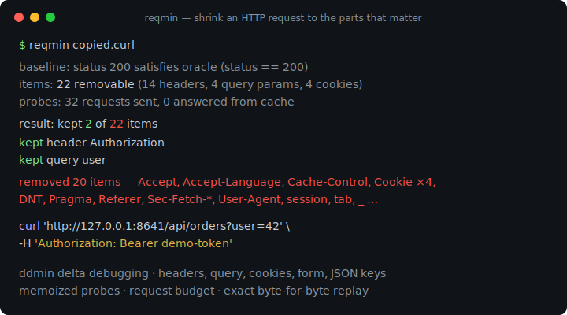
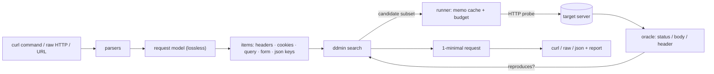

# reqmin

[English](README.md) | [中文](README.zh.md) | [日本語](README.ja.md)

[](LICENSE) [](go.mod) [](CHANGELOG.md)  [](CONTRIBUTING.md)

**reqmin：开源的 HTTP 请求 delta-debugging 最小化工具——粘贴一条带 40 个请求头的 "Copy as cURL"，拿回真正能复现问题的那两个。**



```bash
git clone https://github.com/JaydenCJ/reqmin && cd reqmin
go build -o reqmin ./cmd/reqmin    # single static binary, stdlib only
```

> 预发布说明：v0.1.0 尚未发布到任何包仓库；请按上述方式从源码构建（Go ≥1.22 均可）。

## 为什么选 reqmin？

每个调过 API 的人都熟悉这套仪式。请求出了问题，点一下 "Copy as cURL"，剪贴板里落下 40 个请求头、十几个 cookie，还有没人记得是谁加的查询参数。到底是哪三个触发了 bug？现有的办法全都不够好。在终端或 Postman 式客户端里手工二分，意味着删一个头、重发、撤销的漫长循环——一个 O(n) 的苦役，人人做到一半就放弃，这也是为什么 bug 报告至今仍附着完整的 40 头大块头。通用文件缩减器（creduce、delta）跑的是绝妙的算法，但基底选错了：它们咀嚼字节和行，随手就产出不合法的 HTTP，而且对真正要紧的结构一无所知——`Cookie` 头其实是六个独立的 cookie，JSON 体是一棵键树，删掉一个查询参数绝不能把邻居重新编码。reqmin 把这个算法放到了正确的基底上：先把请求分解成请求头、cookie、查询参数、表单字段和嵌套 JSON 键，然后运行 ddmin——探测子集、记忆化重复项、受请求预算约束——直到得到 **1-minimal** 的请求：再删任何一项，行为就消失。典型结果：22 项缩到 2 项，约 30 次自动探测，末端吐出一条可直接粘贴的 curl 命令。

| | reqmin | 手工二分 | Postman 式客户端 | creduce 式缩减器 |
|---|---|---|---|---|
| 自动找出最小复现子集 | ✅ ddmin，1-minimal | ❌ 你就是循环 | ❌ 你就是循环 | ✅ 但基于行 |
| 理解 HTTP 结构（cookie、JSON 键、参数） | ✅ 6 种条目 | — | — | ❌ 字节和行 |
| 每个候选都是合法的 HTTP 请求 | ✅ 构造即保证 | ✅ | ✅ | ❌ |
| 幸存部分与原始请求逐字节一致（不重编码） | ✅ | ✅ | ⚠️ 客户端会重新序列化 | ❌ |
| 对目标服务器的成本控制 | ✅ 记忆缓存 + 预算 | — | — | ❌ 不设限的运行 |
| 支持粘贴的 `curl` 与原始 HTTP、离线、零依赖 | ✅ | ✅ | ❌ GUI 应用 | ⚠️ 需要脚本挂架 |

<sub>依赖数核查于 2026-07-13：reqmin 只导入 Go 标准库；流行的交互式 API 客户端则以完整桌面应用的形态分发。</sub>

## 特性

- **请求界的 creduce** —— 在请求头、查询参数、单个 cookie、表单字段、嵌套 JSON 键与不透明请求体上运行 Zeller 的 ddmin；结果对你的判定器可证明是 1-minimal。
- **吃得下浏览器吐的一切** —— 真正的 shell 分词器（单引号/双引号/`$'…'` 引用、续行）加上 DevTools 会产出的 curl 旗标子集；原始 HTTP/1.1 报文和裸 URL 同样可用，来源可以是文件、stdin 或 argv。
- **"仍然复现"由你定义** —— `--expect-status`、`--expect-body-contains`、`--expect-body-regex`、`--expect-header`，逻辑与连接；不带旗标时锁定基线状态码。
- **幸存者零损耗** —— 保留的查询/表单对维持原有的百分号编码，请求头维持顺序与重复项，JSON 维持成员顺序与数字字面量；与原始请求的差异只有删除。
- **对目标彬彬有礼** —— 相同候选由记忆缓存直接应答，`--max-requests` 给运行设上限（预算耗尽仍会输出已找到的最佳缩减），重定向只报告、不跟随。
- **忠实重放** —— 不注入 `User-Agent` 或 `Accept-Encoding`，`Content-Length` 重新计算；打印的就是实际发出的，形式可为 curl 单行、原始 HTTP 报文或 JSON 报告。
- **零依赖、完全离线** —— 仅 Go 标准库；无遥测，唯一的对外流量就是你要求的探测，发往你指定的目标。

## 快速上手

```bash
go run ./examples/demo-server &    # loopback API that checks only a token and ?user=
./reqmin examples/copied.curl      # a 14-header, 4-cookie browser capture
```

真实抓取的输出——22 个可删条目，32 次环回探测，2 个幸存：

```text
baseline: status 200 satisfies oracle (status == 200)
items: 22 removable (14 headers, 4 query params, 4 cookies)
probes: 32 requests sent, 0 answered from cache
result: kept 2 of 22 items
  kept     header  Authorization
  kept     query   user
curl 'http://127.0.0.1:8641/api/orders?user=42' -H 'Authorization: Bearer demo-token'
```

报告写到 stderr，最小化后的请求写到 stdout——可以直接接管道，或者改写成原始 HTTP 报文。显式判定器可以钉住你关心的行为（真实输出）：

```bash
./reqmin --format raw --expect-body-contains '"orders"' examples/copied.curl
```

```text
GET /api/orders?user=42 HTTP/1.1
Host: 127.0.0.1:8641
Authorization: Bearer demo-token
```

`--dry-run` 只列出可删条目而不发送任何请求；`bash examples/reduce.sh` 端到端跑完整个演示。

## 输入与判定器

reqmin 自动识别输入：带引号的 `curl …` 字符串、包含它的文件（续行没问题）、原始 HTTP/1.1 报文（文件或 `-` 表示 stdin）、裸 URL，或不带引号的 `reqmin curl https://… -H …` argv。谓词以 AND 组合：

| 旗标 | 默认 | 效果 |
|---|---|---|
| `--expect-status N` | 基线状态码 | 响应状态码必须等于 N |
| `--expect-body-contains S` | — | 响应体必须包含 S（可重复） |
| `--expect-body-regex RE` | — | 响应体必须匹配该 RE2 模式 |
| `--expect-header 'K: v'` | — | 响应头 K 必须包含 v；裸 `K` 只检查存在性 |

## 搜索与输出控制

| 旗标 | 默认 | 效果 |
|---|---|---|
| `--keep GLOB` | — | 钉住匹配的条目（`authorization`、`header:x-*`）；永不删除 |
| `--only KINDS` | 全部 | 限定为 `headers,query,cookies,form,json,body` |
| `--max-requests N` | 500 | 探测预算；耗尽时仍输出已找到的最佳缩减 |
| `--timeout D` | 10s | 单请求超时 |
| `--format F` | curl | `curl`、`raw` 或 `json`（完整的机器可读报告） |
| `--out FILE` / `--dry-run` / `-q` | — | 写入文件 / 仅枚举 / 静默报告 |

退出码：**0** 已最小化 · **1** 基线不满足判定器 · **2** 用法错误 · **3** 网络/运行时失败。算法、条目模型，以及 1-minimality 承诺什么（和不承诺什么），见 [docs/reduction.md](docs/reduction.md)。

## 验证

本仓库不携带 CI；上面的每一条主张都由本地运行验证：

```bash
go test ./...            # 92 deterministic tests, offline, < 5 s
bash scripts/smoke.sh    # end-to-end CLI check against a loopback API, prints SMOKE OK
```

## 架构



## 路线图

- [x] v0.1.0 —— 带记忆化与预算的 ddmin 引擎、六类条目模型（请求头、cookie、查询、表单、嵌套 JSON 键、原始体）、curl/原始 HTTP/URL 输入、状态/响应体/响应头判定器、零损耗 curl/raw/json 输出、`--keep`/`--only`/`--dry-run`、92 个测试 + smoke 脚本
- [ ] 值级缩减：收缩请求头与参数的*值*（截断 token、JSON 数组元素）
- [ ] 面向不稳定端点的 `--stable N` 复验，分歧时自动重试
- [ ] HAR 文件输入：从浏览器会话导出中挑出一条请求
- [ ] 面向慢目标的并行探测（带并发上限）
- [ ] 响应差异判定器："复现" = 与基线响应一致（可配置忽略列表）

完整列表见 [open issues](https://github.com/JaydenCJ/reqmin/issues)。

## 参与贡献

欢迎 issue、讨论与 PR——本地工作流（格式化、vet、测试、`SMOKE OK`）见 [CONTRIBUTING.md](CONTRIBUTING.md)。入门任务标注在 [good first issue](https://github.com/JaydenCJ/reqmin/issues?q=is%3Aissue+is%3Aopen+label%3A%22good+first+issue%22)，设计讨论在 [Discussions](https://github.com/JaydenCJ/reqmin/discussions)。

## 许可证

[MIT](LICENSE)
